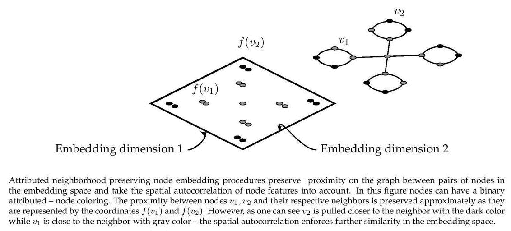

TENE 
====
[](https://codebeat.co/projects/github-com-benedekrozemberczki-tene-master) [](https://github.com/benedekrozemberczki/TENE/archive/master.zip)⠀[](https://twitter.com/intent/follow?screen_name=benrozemberczki)
### Abstract
<p align="justify">
A sparsity aware implementation of **Enhanced Network Embedding with Text Information**. Network embedding aims at learning the low dimensional and continuous vector representation for each node in networks, which is useful in many real applications. While most existing network embedding methods only focus on the network structure, the rich text information associated with nodes, which is often closely related to network structure, is widely neglected. Thus, how to effectively incorporate text information into network embedding is a problem worth studying. To solve the problem, we propose a Text Enhanced Network Embedding (TENE) method under the framework of non-negative matrix factorization to integrate network structure and text information together. We explore the consistent relationship between node representations and text cluster structure to make the network embedding more informative and discriminative. TENE learns the representations of nodes under the guidance of both proximity matrix which captures the network structure and text cluster membership matrix derived from clustering for text information. We evaluate the quality of network embedding on the task of multi-class classification of nodes. Experimental results on all three real-world datasets show the superior performance of TENE compared with baselines.
</p>
<div style="text-align:center"></div>

The model is now also available in the package [Karate Club](https://github.com/benedekrozemberczki/karateclub).

This repository provides an implementation for **TENE** as described in the paper:
> Enhanced Network Embedding with Text Information.
> Shuang Yang, Bo Yang 
> ICPR, 2018.
> https://ieeexplore.ieee.org/abstract/document/8545577


### Requirements

The codebase is implemented in Python 3.5.2. package versions used for development are just below.
```
networkx          2.4
tqdm              4.28.1
numpy             1.15.4
pandas            0.23.4
texttable         1.5.0
scipy             1.1.0
argparse          1.1.0
```
### Datasets
<p align="justify">
The code takes an input graph in a csv file. Every row indicates an edge between two nodes separated by a comma. The first row is a header. Nodes should be indexed starting with 0. Sample graphs for the `Wikipedia Chameleons` and `Wikipedia Giraffes` are included in the  `input/` directory. </p>

The feature matrix can be stored two ways:
<p align="justify">
If the feature matrix is a **sparse binary** one it is stored as a json. Nodes are keys of the json and features are the values. For each node feature column ids are stored as elements of a list. The feature matrix is structured as:</p>

```javascript
{ 0: [0, 1, 38, 1968, 2000, 52727],
  1: [10000, 20, 3],
  2: [],
  ...
  n: [2018, 10000]}
```
<p align="justify">
If the feature matrix is **dense** it is assumed that it is stored as csv with comma separators. It has a header, the first column contains node identifiers and it is sorted by these identifers. It should look like this:</p>

| **NODE ID**| **Feature 1** | **Feature 2** | **Feature 3** | **Feature 4** |
| --- | --- | --- | --- |--- |
| 0 | 3 |0 |1.37 |1 |
| 1 | 1 |1 |2.54 |-11 |
| 2 | 2 |0 |1.08 |-12 |
| 3 | 1 |1 |1.22 |-4 |
| ... | ... |... |... |... |
| n | 5 |0 |2.47 |21 |


### Options

Learning of the embedding is handled by the `src/main.py` script which provides the following command line arguments.

#### Input and output options

```
  --edge-path    STR        Input graph path.           Default is `input/chameleon_edges.csv`.
  --feature-path STR        Input Features path.        Default is `input/chameleon_features.json`.
  --output-path  STR        Embedding path.             Default is `output/chameleon_tene.csv`.
```

#### Model options

```
  --features       STR         Structure of the feature matrix.                   Default is `sparse`. 
  --dimensions     INT         Number of embeding dimensions.                     Default is 32.
  --order          INT         Order of adjacency matrix powers.                  Default is 3.
  --iterations     INT         Number of power interations.                       Default is 500.
  --alpha          FLOAT       Alignment parameter for feature matrix.            Default is 1.0.
  --beta           FLOAT       Alignment parameter for feature-node embeddings.   Default is 1.0.
  --lower-control  FLOAT       Overflow control parameter.                        Default is 10**-15.  
```

### Examples

The following commands learn a graph embedding and write the embedding to disk. The node representations are ordered by the ID.

Creating a TENE embedding of the default dataset with the default hyperparameter settings. Saving the embedding at the default path.

```sh
$ python src/main.py
```
Creating a TENE embedding of the default dataset with 128 dimensions and approximation order 1.

```sh
$ python src/main.py --dimensions 128 --order 1
```

Creating an embedding of an other dense structured dataset the `Wikipedia Giraffes`. Saving the output in a custom folder.

```sh
$ python src/main.py --edge-path input/giraffe_edges.csv --feature-path input/giraffe_features.csv --output-path output/giraffe_tene.csv --features dense
```
-----------------------------------------

**License**

- [GNU](https://github.com/benedekrozemberczki/TENE/blob/master/LICENSE)

--------------------------------------------------------------------------------
